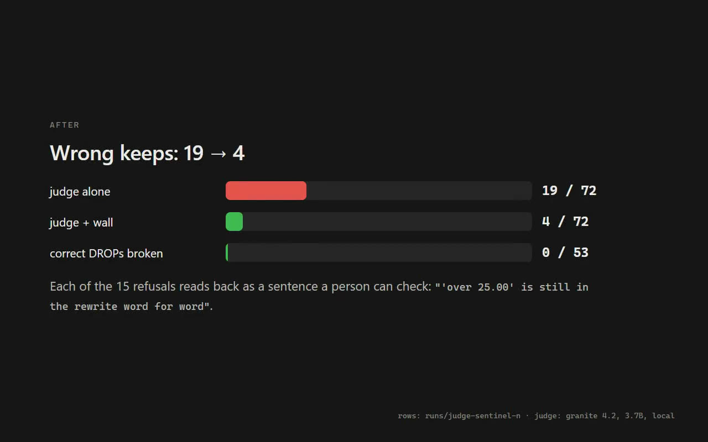
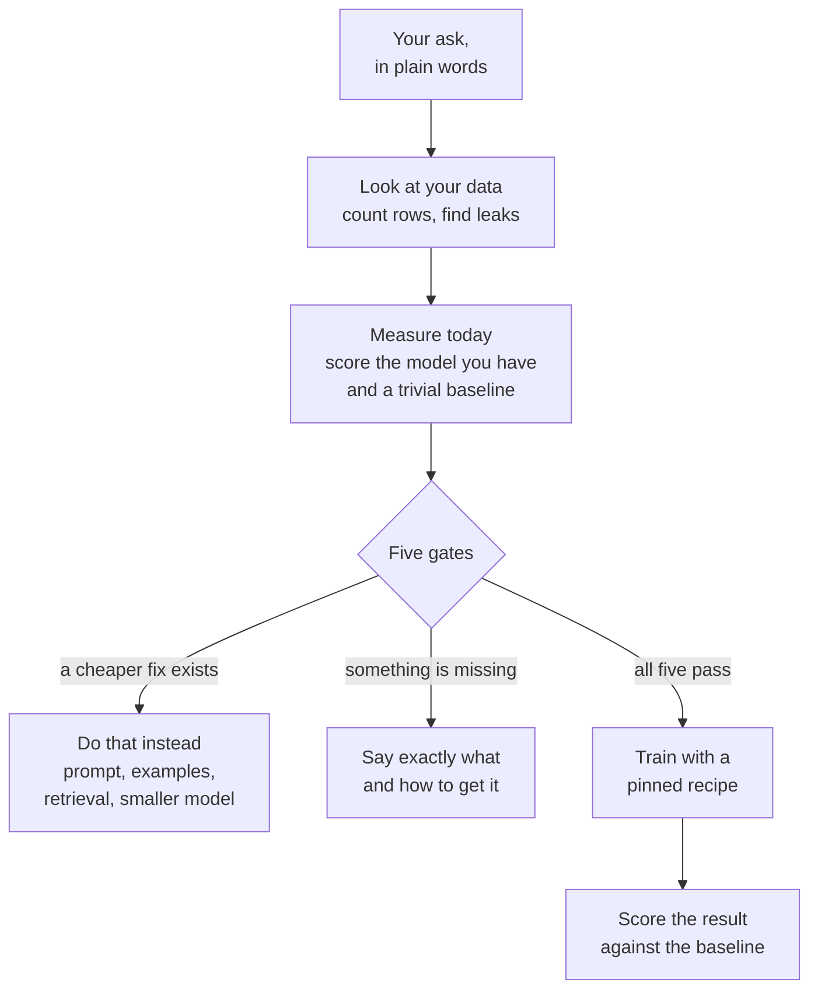
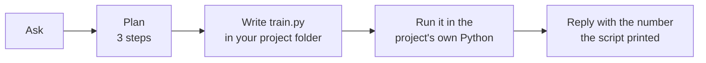
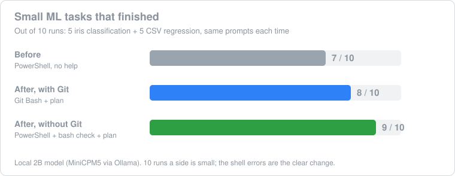
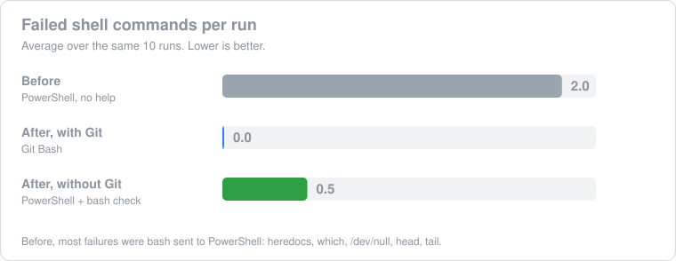
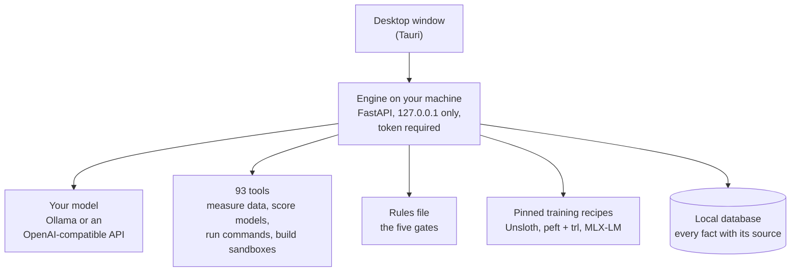

# ML Harness

ML Harness is a desktop app that helps you decide whether to train a machine learning model, and then does the work it decided on. You describe what you want in plain words. It looks at your data, measures where you stand today, and tells you the cheapest thing that will actually work. Often that is a better prompt or a small script, not a fine-tune.

It runs on your own computer, with a model you choose (a local one through Ollama, or any OpenAI-compatible API). Your files stay on your machine.

## ⬇️ Download

<p>
  <a href="https://github.com/naidx0/ml-harness-app/releases/download/v0.1.0/ML-Harness-Setup-0.1.0-x64.exe"></a>
  <a href="https://github.com/naidx0/ml-harness-app/releases/download/v0.1.0/ML-Harness-0.1.0-x64.msi"></a>
  <a href="https://github.com/naidx0/ml-harness-app/releases/latest"></a>
</p>

| | Step | What to do |
|---|---|---|
| 1️⃣ | **Download** | Click the blue **Windows installer** button above. It is one file of about 35 MB. |
| 2️⃣ | **Install** | Double-click it. The installer is not signed yet, so Windows may say *"Windows protected your PC"*. Click **More info**, then **Run anyway**. It installs for your user only and needs no admin rights. |
| 3️⃣ | **Open** | Click the **ML Harness** icon on your desktop or in the Start menu. The first launch sets up its own Python, so it needs internet. On a clean test machine that took 11 seconds. |
| 4️⃣ | **Connect a model** | ML Harness ships no model. Click **Connect a model** and pick one your local [Ollama](https://ollama.com/download) already has, or paste an OpenAI-compatible endpoint and key. A key goes to the Windows credential store, never to a file. |
| 5️⃣ | **Ask** | Type what you want. For example: *"Train a logistic regression on scikit-learn's iris dataset with an 80/20 split and tell me the test accuracy."* |

**You need:** 🪟 Windows 10 or 11, 64-bit · 🌐 internet on the first launch.
**Good to have:** 🦙 [Ollama](https://ollama.com/download) for a free local model · 🔧 [Git for Windows](https://git-scm.com/download/win), because small tasks run a little better in Git Bash · 🎮 an NVIDIA GPU if you plan to train.

🔐 **Check the file.** Each release lists the SHA-256 of every download. In PowerShell: `Get-FileHash .\ML-Harness-Setup-0.1.0-x64.exe -Algorithm SHA256`
🧹 **Uninstall.** Windows Settings → Apps → ML Harness → Uninstall.

## See it run

[](assets/readme/demo.mp4)

A 36-second recording of the real app (click it to play). One plain-language ask, in Full mode. ML Harness writes `train.py` into the project folder, runs it, and reports the accuracy the script printed. The model's thinking time is sped up six times; the whole turn took about two minutes on a small local model (MiniCPM5, 2B, on one RTX 2060 Super).

## Why this exists

Most people who think they need to fine-tune a model don't. They need a clearer prompt, a few good examples, a way to look things up (retrieval), or simply a way to measure whether the model is already good enough. Fine-tuning costs days, a GPU and a pile of data, and when it is the wrong fix it fails quietly: the numbers look fine and nothing improves.

Good training tools already exist. [Unsloth](https://unsloth.ai/) and Hugging Face's peft and trl will train a model for you, fast and for free. But every one of them starts after you have decided to train. None of them asks whether you should.

ML Harness is the step before that. It asks the questions an ML engineer would ask, gets the answers by measuring rather than guessing, and only lets a training run happen when the cheaper options have been tried. When training is the right call, it hands the job to one of those existing trainers instead of reinventing one.

## How it works

You talk to it like a chat assistant. Behind the chat, every answer goes through the same path:



### The five gates

A training run is only reachable after all five pass. Each one exists because skipping it is a common, expensive mistake.

| Gate | What it checks | Why it matters |
|---|---|---|
| **Eval set** | You have at least 30 examples with known right answers. | Without them you cannot tell if training helped. |
| **Baseline measured** | The current model and a trivial baseline (always guess the most common answer) have been scored on those examples. | If the trivial guess already wins, a fine-tune is not the problem to solve. |
| **Prompt tried** | Several prompt versions and few-shot examples were tried first. | A better prompt is minutes of work. Training is days. |
| **Retrieval considered** | Whether the model is missing *knowledge* (look it up) or *behaviour* (train it). | Training does not reliably teach facts. Retrieval does. |
| **Cheaper model considered** | Whether a smaller or different model already does the job. | The cheapest model that passes is the one you want. |

The gates are not a prompt the model could talk its way around. They live in a rules file (`docs/diagnosis_engine.yaml`), the engine checks them, and the tests make sure no training outcome can be reached any other way. A number the model merely claims does not open a gate. Only a measurement does.

The same engine reads two more rule files for other kinds of problem: `docs/ledgers/ai_engineering.yaml` for apps built on a model (agents, retrieval, prompts), with five gates of its own, and `docs/ledgers/harness_design.yaml` for agent harness design, with six.

### Small tasks: it just does them

Not every ask needs a diagnosis. "Train a logistic regression on iris and tell me the accuracy" is a five-line script. For asks like that, ML Harness uses a short three-step plan and does the work itself:



Three details make this reliable on a normal Windows PC:

- **The right shell.** Small local models write Linux-style shell commands. Windows runs PowerShell, which rejects most of them. So ML Harness runs commands in Git Bash when Git for Windows is installed. Without Git, it catches the Linux-style commands before PowerShell sees them: it writes the file the model meant to write, and translates or explains the rest.
- **Its own Python per project.** Each project gets a private Python environment with numpy, pandas and scikit-learn already in it. Nothing the model installs touches your system Python.
- **Numbers come from the run.** The reply reports what the script printed, and the app records where every number came from (measured, stated, or assumed) and shows it.

### Before and after

These are from the same two tasks run 10 times on each setup (5 iris classification runs, 5 linear regression runs on a CSV), with a small local model.





Ten runs a side is a small sample, so the finish counts are a modest gain. The shell errors are the clear change: the commands that used to fail now run. Each fix was also tried on its own, and each did worse than the baseline alone (between 2 and 5 of 10). Only the combinations above were kept.

On a clean Windows machine with no Python, no Git and no Ollama installed, the released installer installed, opened from its desktop icon in 11 seconds, connected a local model, and finished the iris task in 129 seconds.

## How it is put together



- **Local first.** The engine listens only on your own machine and asks for a token on every request. API keys go to the Windows credential store, never into the database.
- **Bring your own model.** The harness is the reasoning around the model, not the model. Swap models without changing anything else.
- **93 registered tools in 15 capability packs.** Each tool is described once and gets two faces from that description: the schema the model calls and the button a person clicks. A test checks that count against the code.
- **Pinned recipes.** Training runs through recipe folders with locked dependencies, and the setup refuses to say "ready" unless the GPU build of PyTorch is really installed. On Windows the default PyTorch download is CPU-only, and that mistake is otherwise silent.

## How it compares

| | Chat assistant | Trainer (Unsloth, AutoTrain) | Notebook | **ML Harness** |
|---|---|---|---|---|
| Asks whether you should train | Sometimes, from memory | No, it starts after that decision | Up to you | **Yes, and measures it** |
| Runs code on your machine | Usually not | Training only | Yes, you write it | **Yes, it writes and runs it** |
| Numbers you can trust | It may invent them | Training metrics | Yours | **Each number shows its source** |
| Stops you from training too early | No | No | No | **Five gates** |
| Trains when it should | No | Yes | If you write it | **Yes, through those trainers** |

## Limits

- **Windows first.** It is built and tested on Windows. Apple Silicon and AMD GPU paths are best effort until someone runs them there.
- **Unsigned installer.** Windows SmartScreen will warn until it is code-signed.
- **Generated data is treated with suspicion.** Rows the model generates can never open a gate, and cannot be trained on until a person has checked a sample. The harness cannot tell a right generated answer from a wrong one by itself.
- **Training needs a recipe environment.** Real training needs a recipe's environment built first (one command, below), and an NVIDIA GPU.

## Run from source

```powershell
python -m pip install -e ".[test]"
.\start.ps1                          # engine and UI; reuses what is already right
.\start.ps1 --status                 # say what is running, change nothing
.\start.ps1 --stop                   # stop the engine on --port, and nothing else
python scripts/gate.py               # the test suite, asserting ran == discovered
python scripts/build_recipe_env.py --all          # build the pinned recipe environments
python scripts/build_recipe_env.py --all --check  # verify them, build nothing
mlh doctor                           # what this installation can see, and what it still needs
```

Under the launcher the engine is `python -m uvicorn app.main:app --host 127.0.0.1 --port 8078`. The engine keeps running after you close the terminal, which is why `--stop` exists; it only stops the engine it started.

`scripts/gate.py` runs the whole suite and then checks three things the plain test runner cannot: that every discovered test actually ran, that no test file failed to import, and that the run reached its final verdict.

## Further reading

- [docs/VISION.md](docs/VISION.md): the longer story of what this is for.
- [docs/how-to-verify.md](docs/how-to-verify.md): the rules the project holds its own checks to.
- [The judge record](docs/judge_runs/THE-JUDGE.md): what happened when a model was used to grade other models, including every time its grade was withdrawn.
- [four-asserts](https://github.com/naidx0/four-asserts): four of this project's self-checks, packaged as a small library.

MIT licensed.
